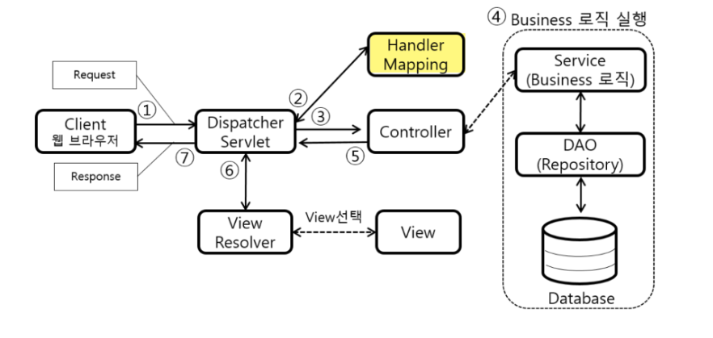

1. Thymeleaf
타임리프는 흔히 View Template(뷰 템플릿)이라고 부른다.

 타임리프는 html태그를 기반으로하여 th:속성을 이용하여 동적인 View를 제공

뷰 템플릿은 컨트롤러가 전달하는 데이터를 이용하여 동적으로 화면을 구성할 수 있게 해준다.

Thymeleaf 템플릿 엔진의 장점은 페이지를 생성하는데 필요한 정보를 태그의 속성으로 넣을 수 있어 유지보수가 간단하다.

3. Spring boot에 Thymeleaf 적용하기
먼저 Thnymeleaf를 사용하기 위해서는 dependency를 추가 해야된다.

📖 Maven(pom.xml)
<dependency>
<groupId>org.springframework.boot</groupId>
<artifactId>spring-boot-starter-thymeleaf</artifactId>
</dependency>
📖 Gradle(build.gradle)
dependencies {
	implementation 'org.springframework.boot:spring-boot-starter-thymeleaf'
    ...
}
타임리프는 MVC패턴 중 View 역할을 담당하고 있기 때문에 데이터 값을 받기 위해선 Controller 가 필요하다.

📖 index.html
<a href="thleaf/ex1">연습 1</a> 
처음 메인페이지에서 연습1 이라는 하이퍼링크를 클릭하면 서버 Cotroller에게 요청을 보낸다.

📖 Controller.java
@Controller
@RequestMapping(value="thleaf")
public class NiceController {
   @GetMapping("/ex1")
   public String abc1(Model model) {
      ItemVo vo = new ItemVo();
      vo.setId("korea1");
      vo.setName("사과");
      vo.setPrice(5000);
      vo.setRegDate(LocalDate.now());
      
      model.addAttribute("vo", vo);
      return "show1";
   }
}
@Controller 선언을 통해 NiceController 클래스는 Controller 역할을 한다.

Controller는 "/thleaf"로 시작하는 모든 요청을 처리하고 "/ex1" 경로로 들어오는 GET 요청

을 처리하는 메소드인 abc1을 정의하고 있다.

이 메소드는 Model 객체를 매개변수로 받아서 모델에 데이터를 추가하고, "show1"이라는 뷰 이름을 반환하여 데이터를 보내게 된다.

📖 show1.html (Thymeleaf)
<html xmlns:th="http://www.thymeleaf.org">
<!-- 생략 -->
<table border="1">
	<tr>
		<td>
			아이디
			
		</td>	
	</tr>
	<tr>
		<td>
			상품명
			
		</td>	
	</tr>
	<tr>
		<td>
			가격
			
		</td>	
	</tr>
	<tr>
		<td>
			등록일
			
		</td>	
	</tr>
</table>
<!-- 생략 -->
</html>
Controller 에게 데이터 값을 받은 view templats 이다.

우리가 아는 HTML이 아니라 thymeleaf 문서이다.

<html xmlns:th="http://www.thymeleaf.org">
html 문서언어는 타임리프를 사용하겠다는 의미이다.

<th:text="${vo.id}"
이 코드는 서버에서 받은 데이터를 화면에 표시하는 데 사용된다.

${vo.id} 이 부분은 Thymeleaf에서 변수나 객체의 속성을 표현할 때 사용하는 표현식이다.

import org.springframework.stereotype.Controller;
import org.springframework.web.bind.annotation.RequestMapping;
@RequestMapping("/")
@Controller
public class WebController {
	
	@RequestMapping("/index")
	public String index() {
		return "index";
	}
}
위 코드는 URL맵핑으로 컨트롤러입니다. JSP때 많으하는 MVC패턴이죠. 거기서 C, 컨트롤러입니다. 스프링에서는 어노테이션이라는것이 들어가게 되는데 클래스를 만들고 @Controller라고 명시하면 이는 컨트롤러가 됩니다. RestController도 있습니다.

@RequestMapping("/")은 주소창에서 /라는 요청이 왔을 때 실행하겠다는 의미입니다. 만약 @RequestMapping("/index")라고 하면 주소창에서 /index가 왔을 때 해당 요청을 처리하겠죠. 

지금있는 코드로 /index요청이 오면 index를 띄우는것으로 되어 있습니다. 여기에 메소드 하나를 만듭니다.

import org.springframework.stereotype.Controller;
import org.springframework.web.bind.annotation.RequestMapping;
@RequestMapping("/")
@Controller
public class WebController {
	
	@RequestMapping("/index")
	public String index() {
		return "index";
	}
@RequestMapping("/test")
	public String test() {
		return "test";
	}
}
추가된것이 /test인데 test페이지를 열기 위하여 메소드를 하나 만들었습니다. 그리고 여기에서 test.html에 값을 넘기기위해서 model을 추가해줄건데요. model추가방법은 아래와 같습니다.

@RequestMapping("/test")
	public String test(Model model) {
        model.addAttribute("test","이거슨 model로 가져온값이다!");
		return "test";
	}
Model은 객체정보를 말합니다. 이 객체를 html변수로 넘길 수 있구요. model.addAttribute를 하면 이 model객체안에다가 데이터를 넣어주는데 key:value형식으로 앞에 첫번째는 키이름, 두번째는 키의 값을 넣으면 됩니다. 위의 같은경우 test라는 키의값이 "이거슨 model로 가져온값이다!"라고 할 수 있습니다. 그럼 이를 html로 출력해 보겠습니다.

templates폴더에 test.html파일을 만들어줍니다.

<!DOCTYPE html>
<html lang="ko" xmlns:th="http://www.thymeleaf.org">
<head>
<meta charset="UTF-8">
<title>Insert title here</title>
</head>
<body>

</body>
</html>
처음 html파일을 만들면 태그들이 자동으로 생성이 되는데 <!DOCTYPE html>태그아래 <html>태그에 위와같이 바꿔줍니다.

<html lang="ko" xmlns:th="http://www.thymeleaf.org">은 html문서언어는 한글이며 타임리프를 사용하겠다는 말입니다.

<body>태그안에 
태그를 만들어서 아래코드를 입력해봅니다.

타임리프엔진에서는 th를 사용합니다. th:text는 텍스트를 출력한다는 속성으로서 th:text="${변수이름}을 입력하면 해당 변수의 값이 text로 

출력이 된다는 말입니다. 
태그를 추가했다면 RUN하여 localhost:8080/test로 접속해봅니다.

특별히 오타를 낸것이 없다면 캡처사진과 같이 아까 컨트롤러에서 model로 넣었던 값이 출력되는 것을 볼 수 있습니다.

th:text는 단순 텍스트 출력할 떄 사용이 되며 if문이나 반복문을 표현 하는방법은 아래와 같습니다.

<!--if문과 if else문 -->

5}">a가 크다

5}>a는 5보다 작다

<!--반복문-->
<th:block th:each="test: ${list}>

</th:block>
반복문의 경우 컨트롤러에서 ArrayList를 사용하여 만들면 됩니다.

다른 html파일을 include하는 방법입니다. 다른 파일을 include하기 위해 현재 html파일을 include할 이름을 설정해주어야 합니다.

설정방법은 th:fragment로 해당 fragment이름을 통하여 다른 html파일에서 include할 수가 있습니다.

뷰 리졸버(View Resolver)
먼저 핸들러 매핑과 핸들러 어댑터를 통해 핸들러를 실행한 이후, 핸들러(컨트롤러)가 처리하고 ModelAndView를 반환한다.
이후 ModelAndView를 알맞은 View로 전달하기 위해 DispatcherServlet에 의해 뷰 리졸버가 호출된다.

즉, 뷰 리졸버는 ModelAndView 객체를 View 영역으로 전달하기 위해 알맞은 View 정보를 설정하는 역할을 한다.
 
뷰 리졸버 활용 예제
OldController.java
@Component("/springmvc/old-controller")
public class OldController implements Controller {
    @Override
    public ModelAndView handleRequest(HttpServletRequest request, HttpServletResponse response) throws Exception {
        System.out.println("OldController.handleRequest");

        return new ModelAndView("new-form");
    }
}
위 코드는 스프링 MVC의 Controller 인터페이스의 구현체 핸들러(컨트롤러)이다.

별다른 로직을 수행하지 않으며, ModelAndView 객체를 반환한다.
ModelAndView에는 “new-form”이라는 문자열 데이터를 포함하고 있다.

 
new-form.jsp
<%@ page contentType="text/html;charset=UTF-8" language="java" %>
<html>
<head>
  <meta charset="UTF-8">
  <title>Title</title>
</head>
<body>
<form action="save" method="post">
  username: <input type="text" name="username" />
  age: <input type="text" name="age" />
  <button type="submit">전송</button>
</form>
</body>
</html>
위 코드는 뷰 리졸버가 찾아서 설정할 실제 View이다.
해당 코드 파일의 위치가 “webapp/WEB-INF/views/”에 위치하고 있다고 가정한다.
 
프로젝트를 실행 후 http://localhost:8080/springmvc/old-controller에 접속하면 Whitelabel Error Page 오류가 발생할 것이다.
 
application.properties
spring.mvc.view.prefix=/WEB-INF/views/
spring.mvc.view.suffix=.jsp

위 코드를 application.properties에 추가하여 다시 실행하면 해당 View가 정상적으로 반환될 것이다.
 
뷰 리졸버 - InternalResouceViewResolver
스프링 부트는 InternalResouceViewResolver라는 뷰 리졸버를 자동으로 등록한다.
이때 application.properties에 등록한 설정 정보를 사용하여 등록하게 된다.

또는 OldController의 리턴 값을 new ModelAndView(”/WEB-INF/views/new-form.jsp”)으로 전체 경로를 주어도 동작하기는 하나 권장하지 않는 방법이다.
 
뷰 리졸버의 동작 방식
스프링 부트가 자동으로 등록하는 뷰 리졸버의 종류는 다양하다.
// 빈 이름으로 뷰를 찾아서 반환한다. (예: 엑셀 파일 생성기능에 사용)
1 = BeanNameViewResolver

// JSP를 처리할 수 있는 뷰를 반환한다.
2 = InternalResourceViewResolver

...

이 외에도 다양한 뷰 리졸버가 있다.

핸들러 어댑터를 통해 논리 뷰 이름을 획득한다.

new-form 획득

ViewResolver를 순차적으로 호출한다.

InternalResourceViewResolver 호출

뷰 리졸버는 뷰 정보를 반환한다.

뷰 리졸버는 InternalResourceView를 반환

반환된 뷰 정보는 forward()를 호출해서 처리할 수 있는 경우에 사용한다.

InternalResourceView는 forward()를 호출

view.render()가 호출되고 해당 뷰가 실행된다

view.render() 호출되고 InternalResourceView는 forward()를 사용해서 JSP를 실행
